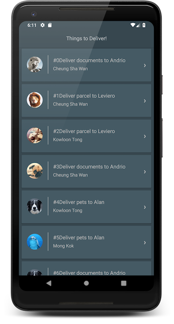

# Delivery
Android application using MVVM, Dagger2, Android Architecture Components, Data binding and Retrofit.

This aplication is completely written in kotlin using ModelViewViewModel architecture.

ScreenShots
-----------

Features
--------
1) Delivery List - List shows items to deliver
    a) Pagination
    b) Response Caching to have offline data
2) Delivery Location on Google Map 

Branches
--------
1) Master - Black themed app
2) white_theme

Pre-requsites
- Add Google Maps API_KEY in the AndroidManifest.xml to use Google Map.

IDE:
- Android studio 3.2.1

Language:
- Kotlin

Architecture
-----------

Libraries
----------
- Retrofit2
- Dagger2
- Android Architecture Components
- Data Binding

Light theme
-----------

